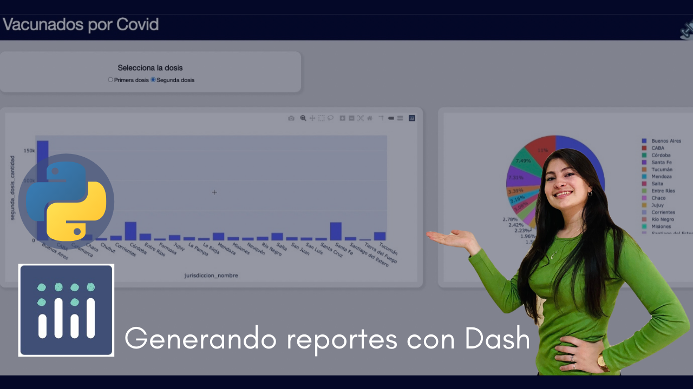

[](https://cafecito.app/datasciencefull)
# Dashboard de vacunados 

### El fin de este proyecto es hacer un dashboard con la infromación descargada de la página Ministerio de Salud con los vacunados hasta ese momento. 

---

#### Utilice Python como lenguaje, Dash y Plotly para graficar. Utilizar la versión de Python 3 en adelante.
 
 ---
### Instalación de librerías:

``` python
pip install dash
pip install dash-renderer
pip install dash-html-components
pip install dash-core-components
pip install pandas
```

Si no tienen pip también deben instalarlo. 

[Haz click aquí para ver el video en YouTube](https://www.youtube.com/watch?v=mI1NYF1dbLU&t=1066s)

Descargar csv de vacunas: [Click aquí](http://datos.salud.gob.ar/dataset/vacunas-contra-covid-19-dosis-aplicadas-en-la-republica-argentina)

Documentación oficial de Dash: [Click aquí](https://dash.plotly.com/)

Instagram: [Click aquí](https://www.instagram.com/nerddatos_/)

.
